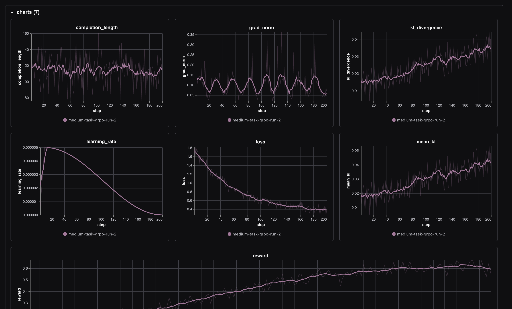

# CrisisOps

**An OpenEnv RL environment for training LLMs as crisis command operators.**

## Links

- **Blog / writeup:** [Coming soon on arorarminaal.com/ai](https://arorarminaal.com/ai)
- **Earlier hackathon submissions:**
  - [DryLabSim](https://huggingface.co/spaces/mrinaalarora/drylabsim)
  - [json_cleaning_env](https://huggingface.co/spaces/mrinaalarora/json-cleaning-env)
- **GitHub repo:** https://github.com/aroramrinaal/crisisops
- **Hugging Face Space:** https://huggingface.co/spaces/mrinaalarora/crisisops
- **Live demo UI:** https://mrinaalarora-crisisops.hf.space/demo
- **Trackio dashboard:** https://mrinaalarora-trackio.hf.space/?project=crisisops-small-model-training&run_ids=easy-task-grpo-run-1%2Cmedium-task-grpo-run-1&sidebar=hidden&navbar=hidden
- **Training scripts:** https://github.com/aroramrinaal/crisisops/tree/main/training-scripts
- **2 Minute YouTube video:** https://youtu.be/9OPGw5CEAiM


<iframe width="560" height="315" src="https://www.youtube.com/embed/9OPGw5CEAiM?si=f3lmNzT1BjAI105E&amp;controls=0" title="YouTube video player" frameborder="0" allow="accelerometer; autoplay; clipboard-write; encrypted-media; gyroscope; picture-in-picture; web-share" referrerpolicy="strict-origin-when-cross-origin" allowfullscreen></iframe>

## The problem

When a disaster hits a city, the people in the operations center don't get clean inputs. They get a flood of noisy citizen reports, half-confirmed sensor pings, and contradicting official updates streaming in over hours. They have to figure out what's actually happening, who to send where, what to evacuate, what to ignore, and they have to do it before deadlines tick down. Mistakes cost lives.

Today's frontier LLMs are surprisingly bad at this. They're great at one-shot answers, but they fall apart when you ask them to track state across a long, partially observable situation, weigh false alarms against real incidents, and make irreversible commitments under time pressure. There's no good RL environment to train them on this either, most public envs are toy games or single-turn benchmarks.

So I built one.

## How CrisisOps got here

I started this hackathon two months into self-teaching ML, going solo. My first submission was [json_cleaning_env](https://github.com/aroramrinaal/json_cleaning_env), a data-cleaning environment that got me through the validator and taught me OpenEnv's spec. My second was [DryLabSim](https://huggingface.co/spaces/mrinaalarora/drylabsim), a biology dry lab where LLMs run computational experiments. Both passed Phase 1 and Phase 2 and got me into the in-person final round in Bangalore.

For the final, I wanted something that pushed harder on what LLMs actually struggle with: long-horizon planning under uncertainty, with real consequences for getting it wrong. Crisis command was the obvious target. It's a real job humans do, the cost of bad decisions is concrete, and there's a clean reward signal hiding inside it (verify before acting, match resources to incidents, hit deadlines, don't trust everything you read).

CrisisOps is the result.

## What the environment does

The agent plays the role of an emergency operations commander. At every step it sees:

- **Visible zones** (incident locations with severity, population at risk, deadlines, access status)
- **Reports** streaming in from citizens, sensors, officials, field teams, and media (with confidence levels)
- **Resources** — limited rescue teams, medical units, supply trucks, evac buses, recon drones
- **An incident log** of what happened recently

It picks one of ten actions: `verify_report`, `flag_false_alarm`, `allocate_unit`, `request_recon`, `reroute_unit`, `issue_evacuation`, `open_shelter`, `dispatch_supplies`, `publish_sitrep`, or `noop`.

The reward function rewards the things that matter in a real crisis room: verifying noisy reports before committing units, matching the right unit type to each incident, resolving critical zones before their deadlines, flagging false alarms, and publishing a clean situation report when the dust settles. It penalizes the things that get people killed: acting on unverified reports, sending the wrong unit, targeting blocked zones, missing deadlines.

## Four difficulty tiers

| Tier | Task ID | Zones | Reports | Episode cap | Key challenge |
|------|---------|-------|---------|-------------|---------------|
| Easy | `single_zone_response` | 1 | 3 | 8 | Verify, allocate, sitrep |
| Medium | `multi_zone_triage` | 3 | 6 | 15 | Concurrent zones, false alarms |
| Hard | `cascading_crisis` | 5 | 10 | 25 | Mid-episode events, streaming reports |
| Expert | `multi_district_coordination` | 9 | 15 | 40 | Multi-district, mutual aid, comms degradation |

All scenarios are deterministic given a seed, all graders are bounded `[0.0, 1.0]`, and the expert tier is genuinely hard for frontier models because it stacks comms degradation, mutual-aid timing windows, and streaming new incidents past step 14.

## How it's built

Standard OpenEnv layout:

```
crisisops/
├── models.py                    # Pydantic action and observation models
├── client.py                    # EnvClient for talking to the server
├── openenv.yaml                 # Tasks and graders manifest
├── inference.py                 # Baseline inference script (root level, hackathon required)
├── server/
│   ├── app.py                   # FastAPI app with session-backed HTTP
│   ├── crisisops_environment.py # Core step/reset/state logic
│   ├── reward.py                # Per-step reward signal (unbounded, for RL)
│   ├── grader.py                # Episode-level graders (bounded [0.01, 0.99])
│   ├── rules.py                 # Domain rules and optimal-plan computation
│   ├── scenario_generator.py    # Deterministic scenario builder
│   ├── scenarios/               # Tier configs, builders, mid-episode events
│   ├── demo/                    # Static HTML/CSS/JS demo at /demo
│   └── Dockerfile
└── tests/                       # Pytest suite (all passing)
```

The reward signal and the grader are intentionally separate. `reward.py` returns unbounded per-step values that GRPO can train on directly. `grader.py` returns bounded `[0.01, 0.99]` episode scores for evaluation and the hackathon validator. They share the same domain rules but neither layers on top of the other.

There's also a hand-built tactical demo UI at `/demo` that plays back a scripted hard-tier episode so judges can see what the agent is reasoning over. It's purely cosmetic, the training and validation pipelines hit `/reset`, `/step`, and `/state` directly.

## Running it

```bash
# Local
git clone https://github.com/aroramrinaal/crisisops
cd crisisops
uv sync
docker build -t crisisops -f server/Dockerfile .
docker run -p 8000:8000 crisisops

# Or hit the deployed Space directly
export ENV_URL=https://mrinaalarora-crisisops.hf.space
export MODEL_NAME=Qwen/Qwen2.5-Coder-3B-Instruct
export HF_TOKEN=your_token
python inference.py
```

## Training

I trained `Qwen/Qwen2.5-Coder-3B-Instruct` with TRL's GRPOTrainer on a Modal H200, using Unsloth for 4-bit loading and LoRA r=16. The reward function in the training loop resets the env with a fixed seed, applies the model's generated action, and feeds the env's per-step reward back into GRPO with a small action-shaping bonus.

Three runs total:
- 1 on easy (`single_zone_response`)
- 2 on medium (`multi_zone_triage`)

The exact training scripts are in [`training-scripts/`](https://github.com/aroramrinaal/crisisops/tree/main/training-scripts).

## Results

[](https://mrinaalarora-trackio.hf.space/?project=crisisops-small-model-training&run_ids=easy-task-grpo-run-1%2Cmedium-task-grpo-run-1&sidebar=hidden&navbar=hidden)

*Reward and loss curves from the three GRPO runs (Trackio dashboard). The reward climbs steadily as the model learns to verify reports before allocating units and to publish coherent sitreps at the end of each episode.*

## Why this matters

If you can train an LLM to act sensibly inside CrisisOps, you've trained it to do something that current models are demonstrably bad at: maintain state across a long noisy trajectory, weigh evidence before committing scarce resources, and recover when the situation changes mid-plan. That's a skill that transfers way beyond disaster response. It's the same shape of problem as triaging a security incident, running an experiment loop, or managing any partially observable real-world workflow.

Built solo by [Mrinaal Arora](https://aroramrinaal.com) for the Meta PyTorch × Hugging Face × Scaler School of Technology OpenEnv Hackathon, April 2026.
